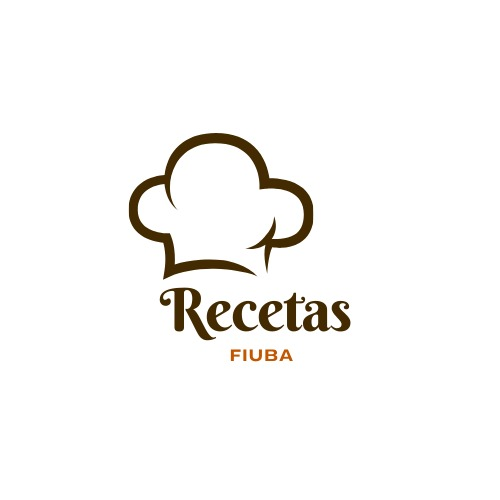

# Recetas FIUBA

## Qué es y cuál es su fin?
Nuestro proyecto es una página de recetas de platos de comida. Esta pagina tiene tres funcionalidades: 

1. Mostrar los platos: Los usuarios pueden ver los platos, guardados en la base de datos, en una vista de la página.

2. Generar una lista de compras: En la base de datos se tienen los ingredientes utilizados para cada plato, éstos se pueden muestran al usuario.

3. Sugerencias de recetas: El usuario puede acceder con un usuarname y password para poder sugerir platos.

## Quiénes lo desarrollan?
Recetas FIUBA es un proyecto en proceso realizado por estudiantes de la Facultad de Ingeniería de la Universidad de Buenos Aires para la materia de Introducción al Desarrollo de Software.

## Cómo instalar lo necesario para que me funcione la página web?
Se deben ejecutar los tres scripts que nuestro equipo brinda. Es primordial que 'initproyecto.sh' sea ejecutado primero, luego de eso, el orden de ejecución de los otros dos scripts es indifirente.

## Integrantes

### Agustin Bermudez
    📧 Email: abermudez@fi.uba.ar
    #️⃣ Padrón: 111863
### Tiago André Calderón
    📧 Email: tcalderon@fi.uba.ar
    #️⃣ Padrón: 111894
### Mateo Gonzalez Pautaso
    📧 Email: magonzalezp@fi.uba.ar
    #️⃣ Padrón: 111699
### Alejandro Mendez
    📧 Email: aomendez@fi.uba.ar
    #️⃣ Padrón: 111756
### Cristian Ezequiel Urbina
    📧 Email: curbina@fi.uba.ar
    #️⃣ Padrón: 112374
### Lorenzo Julián Vega
    📧 Email: ljvega@fi.uba.ar
    #️⃣ Padrón: 111911
### Ignacio Verruno
    📧 Email: iverruno@fi.uba.ar
    #️⃣ Padrón: 111910